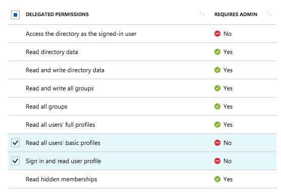
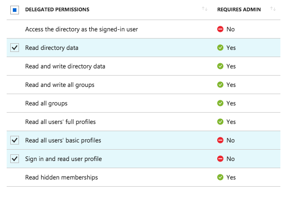
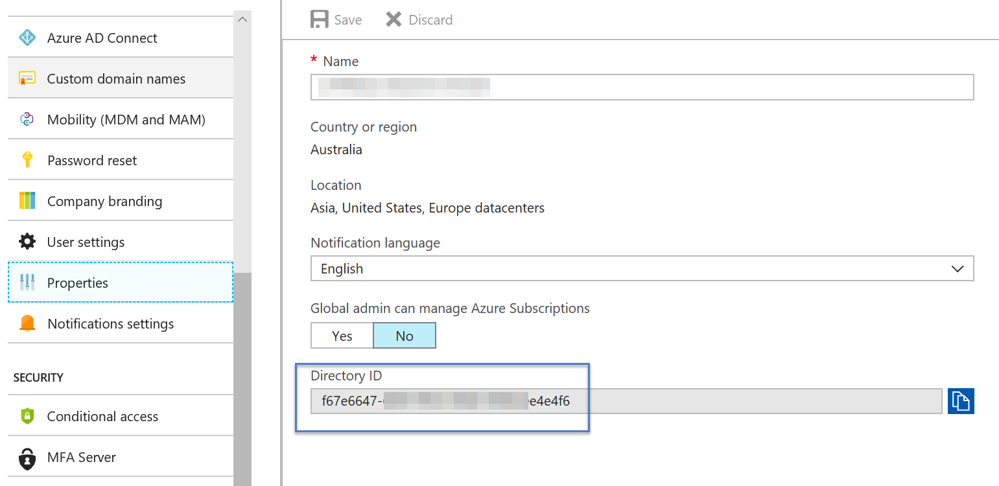
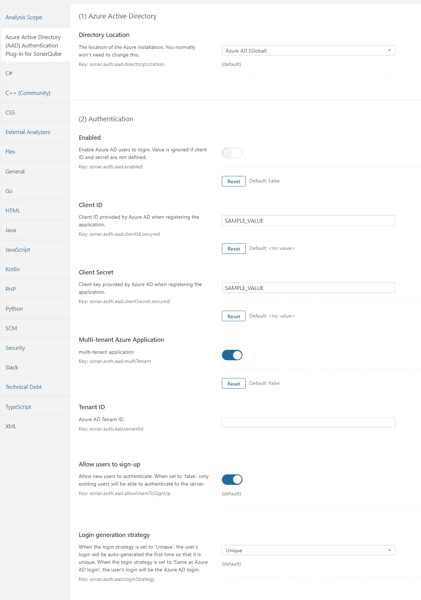

Azure Active Directory (AAD) Authentication Plug-in for SonarQube
=================================================================

Description
-----------

This plug-in enables Azure Active Directory (AAD) users to automatically be sign
up (a login is created if they don’t have one already) and authenticated on a
SonarQube server.

Prerequisites
-------------

### Enable HTTPS on SonarQube

The Azure Active Directory Authentication Plug-in for SonarQube is an OAuth 2.0
provider for SonarQube. For security reasons, HTTP is not supported. HTTPS must
be used, by configuring it on the SonarQube server if this is not done already.

`Server base URL` property must be set to this HTTPS URL either by setting the
property from SonarQube administration page (General -\> Server base URL) or
through setting `sonar.core.serverBaseURL` key value in the sonar.properties
file.

For more details, on how to setup HTTPS on SonarQube, please see [Securing the
Server behind a
Proxy](http://docs.sonarqube.org/display/SONAR/Securing+the+Server+Behind+a+Proxy)

### Create Active Directory application under your Azure Active Directory tenant

1.  Sign in to the [Azure management portal](https://portal.azure.com).

1.  Click **Azure Active Directory** in the left navigation bar.

1.  Click **App registrations**, and then select **New application registration**

1.  Follow the prompts to create a Web Application and/or WebAPI.
	1.  Name describes the app to users, for example `SonarQube Azure Authentication`
	1.  Application type should be "**Web app / API**"
	1.  Sign-On URL is the base URL for your SonarQube Server, example `https://localhost:9000`. You can change this later as needed.
	1.  Click on the **Create button**

1. After you've completed the registration, Azure AD assigns the app a unique application ID. Copy the value from the app page, you will need later to to set the **Client ID**.

1. Go into the **Settings** page of your application
    1. In **Reply URL**, remove the existing URL. Add SonarQube Server URL and append `https://<SonarQube_ServerURL>/oauth2/callback/aad`, example `https://localhost:9000/oauth2/callback/aad`
    1. In **Keys**, create a key for your application with 1 year expiry duration. Copy the value of the key, you will need later to set the **Client Secret**.
    1. In **Required permissions**, make sure the application has access to **Windows Azure Active Directory**. Check that **Sign in and read user profile** delegated permissions is selected, and add the **Read all users' basic profiles** permission. Don't forget to click on **Save**.

	

1. If you enabled group synchronization, make sure the application has access to **Windows Azure Active Directory**. **Read all groups** delegated permissions should be selected.

	

	>   **NOTE:** Only grant this permission if you're planning to use groups
	>   synchronization feature, and always avoid grant the application unnecessary
	>   permissions. In some cases, grant the application additional permissions
	>   will requires an administrator (at the tenant level) give a consent to allow
	>   your application to use such permissions. If the consent of an administrator
	>   was not given and a non-administrator user tries to login to the application
	>   while group synchronization feature is on, user will receive the following
	>   error message : **AADSTS90093 – Calling principal cannot consent due to lack
	>   of permissions**. For more information please read [Permission scopes | Graph API concepts](https://msdn.microsoft.com/en-us/library/azure/ad/graph/howto/azure-ad-graph-api-permission-scopes)

1.  If your application is a single tenant application, you need to provide the tenant id in the provider settings. You can retrieve the tenant id by leaving the App Registration and navigating to the **Properties** section of the tenant and retrieving the **Directory ID** as shown below.

	

1.  Make a note of the **Application ID**, **Key** value, and **tenant Id**. You will need this later when you configure your application. 

For a more detailed walkthrough, [Create Active Directory application and service principal using portal](https://azure.microsoft.com/en-us/documentation/articles/resource-group-create-service-principal-portal/).

Installation and configurations
-------------------------------

### Install Azure AD Authentication plug-in

1.  Download and Copy **sonar-auth-aad-plugin-1.0** to SonarQube server plugin folder under extensions folder. You can download the plugin from SonarQube Update Center or from GitHub https://github.com/SonarQubeCommunity/sonar-auth-aad/releases

1.  **Restart** SonarQube Server

### Configure Azure AD Authentication plugin

1.  Login to SonarQube with an administration account.

1.  On the main menu, go to **Administration** .

1.  Click **Azure Active Directory** under **Category** menu, and provide the
    following values:

	1.  Set the **Enabled** property to true

	1.  Set the **Client ID** from the value provided by the Azure AD application (Application ID).

	1.  Set the **Client Secret** from the value provided by the Azure AD application.

	1.  Set the **Multi-tenant Azure Application** value based on the configuration of the Azure application.

	1.  For a single tenant application, set the **Tenant ID** to the Azure AD tenant Id.

	1.  Set **Login generation strategy** value:

		1.  '**Unique**', the user's login will be auto-generated the first time so that it is unique.

		1.  '**Same as Azure AD login**', the user's login will be the Azure AD login.

	1.  Click **Save Authentication Settings**.

	1.  Sign out and go to the log in form. A new button named "**Log in with Azure AD**" allows users to sign in with their Azure AD account.

	

### General Configurations

| Property Key                        | Property Name                  | Description                                                                                                                                                                                                                                                                                                                                                                                     | Default value |
|-------------------------------------|--------------------------------|-------------------------------------------------------------------------------------------------------------------------------------------------------------------------------------------------------------------------------------------------------------------------------------------------------------------------------------------------------------------------------------------------|---------------|
| sonar.auth.aad.enabled              | Enabled                        | Enable Azure AD users to log in. Value is ignored if client ID and secret are not defined.                                                                                                                                                                                                                                                                                                      | false         |
| sonar.auth.aad.clientId.secured     | Client ID                      | Client ID provided by Azure AD when registering the application.                                                                                                                                                                                                                                                                                                                                | None          |
| sonar.auth.aad.clientSecret.secured | Client Secret                  | Client password provided by Azure AD when registering the application.                                                                                                                                                                                                                                                                                                                          | None          |
| sonar.auth.aad.multiTenant          | Multi-tenant Azure Application | Set the value to True if users from other Azure Active Directories can consent to the application and sign in to it.                                                                                                                                                                                                                                                                            | false         |
| sonar.auth.aad.tenantId             | Tenant ID                      | Azure Active Directory Tenant Id. This value is optional if sonar.auth.aad.multiTenant set to True                                                                                                                                                                                                                                                                                              | None          |
| sonar.auth.aad.allowUsersToSignUp   | Allow users to sign-up         | Allow new users to authenticate. When set to 'false', only existing users will be able to authenticate to the server.                                                                                                                                                                                                                                                                           | true          |
| sonar.auth.aad.loginStrategy        | Login generation strategy      | When the login strategy is set to '**Unique**', the user's login will be auto-generated the first time so that it is unique. When the login strategy is set to '**Same as Azure AD login**', the user's login will be the Azure AD login. This last strategy allows, when changing the authentication provider, to keep existing users if logins from a new provider are the same as Azure AD). | Unique        |

### Groups Synchronization

This feature was introduced in the 1.1-RC1 version of the plugin.

| Property Key                    | Property Name                 | Description                                                                                                                                                                             | Default value |
|---------------------------------|-------------------------------|-----------------------------------------------------------------------------------------------------------------------------------------------------------------------------------------|---------------|
| sonar.auth.aad.enableGroupsSync | Enable Groups Synchronization | Enable groups syncronization from Azure AD to SonarQube, For each Azure AD group user belongs to, the user will be associated to a group with the same name(if it exists) in SonarQube. | false         |

Additional Configurations
-------------------------

1.  **Customize Profile Picture** This can be simply done by linking your email to an existing Gravitar account or by creating a new one. In SonarQube Gravitar support is enabled by default, using gravitar.com. You can configure a different server or disable the feature altogether. Refer to [Look and Feel](http://docs.sonarqube.org/display/SONAR/Look+and+Feel)

1.  **Managing AAD users access to SonarQube** To restrict access to SonarQube to a given group of AAD users, there are currently two ways to do so:

	1.  **From SonarQube Server**, set "Allow Users to SignUp" property to False in AAD settings. When set to 'false', only existing local/AAD users will be able to authenticate to the server. SonarQube Administrator can add local users manually to the server. refer to [Authentication](http://docs.sonarqube.org/display/SONAR/Authentication)

	1.  **From Azure Active Directory Application settings**, restricting the access to the Azure application you created in "Create Active Directory application under your Azure Active Directory tenant" section. Refer to [Managing access to apps](https://azure.microsoft.com/en-us/documentation/articles/active-directory-managing-access-to-apps)

Troubleshooting
--------------------
* Some users havving IIS as a reverse proxy reported getting an HTTP 404 error while submitting a new project analysis  when the size of the SonarQube analysis report was too big. This was due to IIS max request length (set to 1000000 bytes (9.5MB) by default).
	To increase the *max request length* on IIS:
	1. Connect to the server
	1. Highlight the server in the "Connections" pane, and double-click on "request filtering"
	1. In the "Actions" pane, click "Edit Feature Settings..."
	1. Modify the "Maximum allowed content length" field to the desired maximum size in bytes

* Some users having IIS as a reverse proxy with SSL certificate following the tutorial [Configure SSL for SonarQube on Windows](http://blog.jessehouwing.nl/2016/02/configure-ssl-for-sonarqube-on-windows.html) when try to login with Azure Active Directory the URL has as hostname the same as default domain.
	To perform login without this issue:
	1. Go to the windows server.
	1. Open IIS Manager (Internet Information Services Manager).
	1. Highlight the server in the "Connections" pane, and double-click on "Application Request Routing Cache"
	1. In the "Actions" pane, click "Server Proxy Settings..."
	1. Uncheck "Reverse rewrite host in response headers"
Then, when you click on **Log in with Azure AD** in Login page, the redirection to login.microsoftonline.com correctly.
